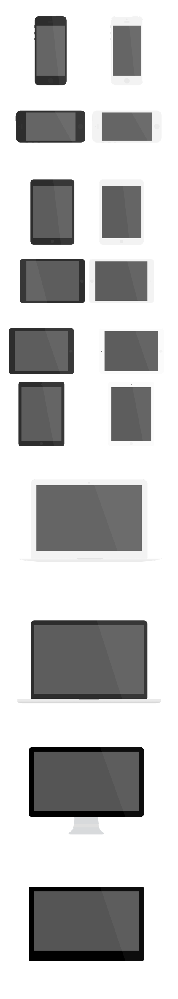

# Sketch Devices
A collection of different devices created in Sketch for use in mockups etc.

All screen areas in these documents have the correct ratio resolution-wise, meaning you can drop in you screenshots and they will fit perfectly.

The [marketing images provided by Apple](https://developer.apple.com/app-store/marketing/guidelines/#images) themselves were used as the basis for these designs.

Devices currently included:

- iPhone 5s (white and black, vertical and horizontal)
- iPad Air (white and black, vertical and horizontal)
- iPad Mini Retina (white and black, vertical and horizontal)
- Macbook Air 13"
- Macbook Pro Retina 13"
- Thunderbolt Display
- TV

# Previews

